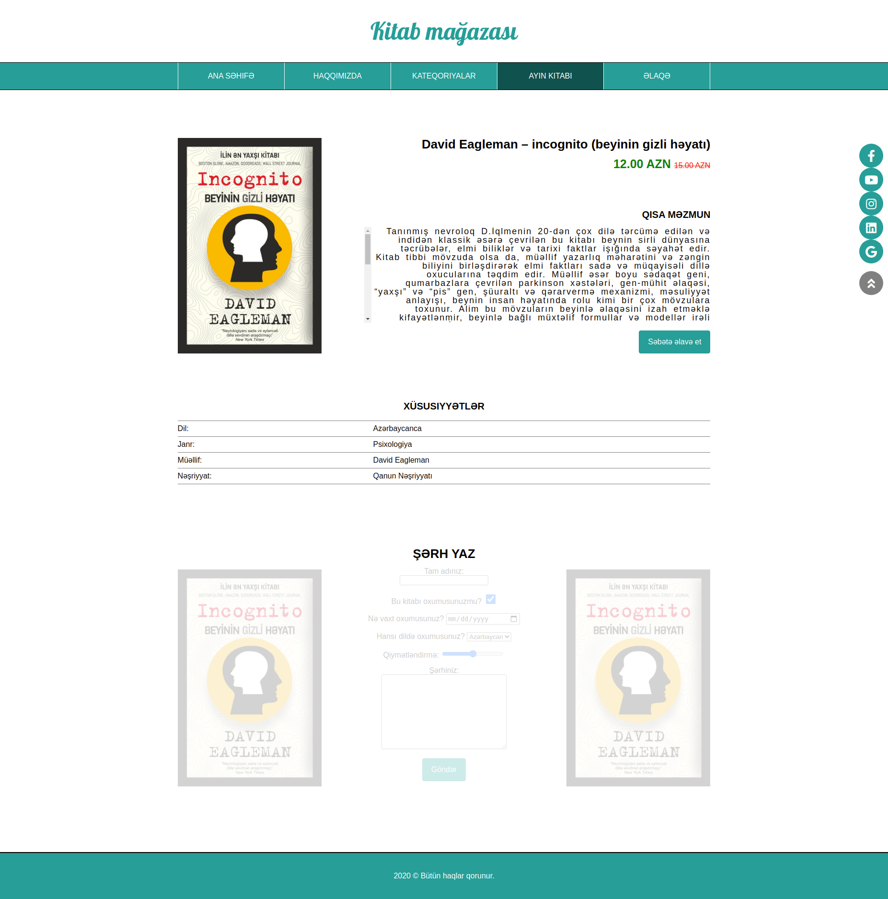

## BeginnerSE first sprint project: E-commerce website

### 5.day tasks

* Should be processed on the product.html file and the page shown in the image should be retrieved one by one
* The menu section must be prepared using Flex
* 1px white border should be placed on the right and left sides of the menu items. Borders between them should not look thick. Just give all the elements a right border, just add a left border in addition to the first element. (use first-child)
* The color of the 4th menu should be darker (use nth-child)
* When you go over the menu sections, you should see a pointer, the background of the section should be white, and the text should be in the background color.
* When clicked, the color should change to the color of the 4th menu.
* When you go to the 4th menu, the pointer should not be visible, just an arrow should be visible and there should be no change in color.
* All information about the book should be pressed to the right.
* Previously set imaginary borders must be removed.
* Long text should be placed in the content section and scrolling should be allowed. Just scroll on the Y axis should appear.
* Scroll should be held to the left. (It is an additional task. Need to investigate.)
* If you have not completed the borders in the table, you can already do so. (use last-child)
* The transparency of the comment section should be reduced, and the section should be fully visible when you hover over it.
* The background should be yellow when you write the name and date on the form.
* If the option to read the book is checked, the mark should grow. (20px x 20px)

### 5.day questions

* Write your answers to the answers.txt file in this folder.
* Explain in your own words, in your own language
* What was the most interesting topic from what you have learned so far? (Why)
* What can you do with what you've learned so far?

<a href="https://www.figma.com/file/5RpyjHqvk69GodpvkZPXKA/Untitled?node-id=1%3A2">You can get the fonts and exact sizes from the figma file.</a>

